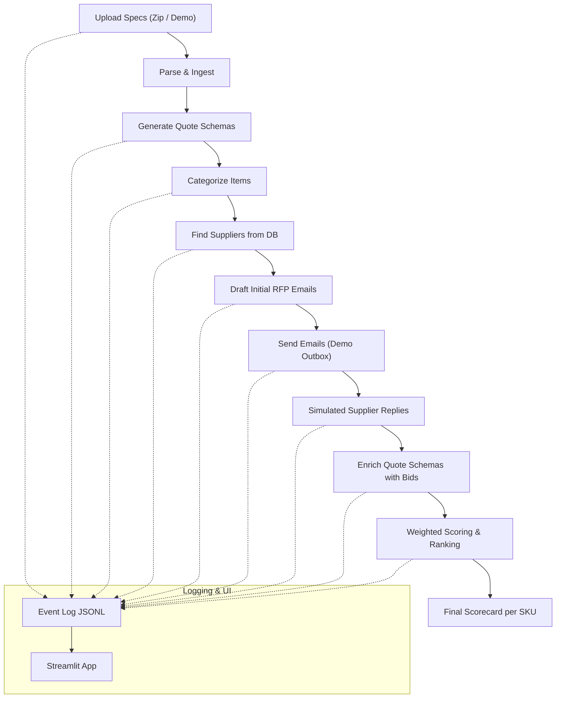

# Vendor Negotiation Agent

## Problem Statement

1. **Procurement is negotiation-heavy but repetitive**: Enterprises often need to collect quotes for many SKUs/services, categorize them, reach out to relevant suppliers, and compare bids, a process that is manual, slow, and error-prone.
2. **Suppliers communicate heterogeneously** (emails, PDFs, spec sheets, vague ranges), making it hard to normalize inputs and fairly evaluate vendors.

---

## What this PoC Does

* **Ingests SKU/Service specs** (demo text files or uploaded zip of specs).
* **Generates quote schemas** (structured JSON with expected fields like specification, OTIF, payment terms, price).
* **Categorizes items and finds suppliers** from a seed database.
* **Drafts initial RFP emails** per supplier per SKU.
* **Sends initial outreach** (demo → stored as JSON “outbox”).
* **Parses simulated supplier replies** into structured bids.
* **Computes weighted scores and rankings** per SKU, producing a transparent scorecard.
* **Logs every step** (JSONL) so actions and reasoning can be surfaced in the Streamlit UI.

The accompanying Streamlit app demonstrates the flow visually:

1. Upload or use demo specs → view contents.
2. Generate schemas → carousel preview.
3. Categorize + fetch suppliers → supplier tables per SKU.
4. Draft emails → carousel of outreach drafts.
5. Simulate email chain → agent request + supplier reply.
6. Weighted scoring → final per-SKU ranking and formula view.
7. Agent log viewer → turn-by-turn trace of what the system is “thinking.”



---

## Future Directions

* **Turn-by-turn supplier negotiation**: extend from one-shot RFQ to iterative bargaining, updating quote schemas dynamically with each supplier round.
* **Richer SKU/Service bids**: handle full enterprise-grade PDF spec sheets, extract complex requirements, and map them into schemas.
* **Simulated realistic negotiations**: integrate evaluation libraries (e.g., Maxim AI) to stress-test the agent with lifelike supplier behavior.
* **From PoC to Production**: showcase how an LLM-driven agentic prototype can graduate into production systems that reduce procurement cycle times and standardize negotiations.

---

### Objective

I designed this PoC to **showcase agentic system design**, and how how to break down a real procurement workflow into steerable, LLM-driven steps with clear logging, replayability, and visualizations. Clear agentic system design at the ground level can build out the foundation for building scalable, production-grade vendor negotiation platforms.

**To use yourself - quickstart**

```bash
pip install -r requirements.txt
python main.py
```

Populate an env file with the required details:
```plaintext
GEMINI_API_KEY
GEMINI_MODEL
LLM_TEMPERATURE
MAX_OUTPUT_TOKENS
SENDGRID_API_KEY
SENDGRID_FROM_EMAIL
SENDGRID_FROM_NAME
SUPABASE_URL
SUPABASE_ANON_KEY
```
